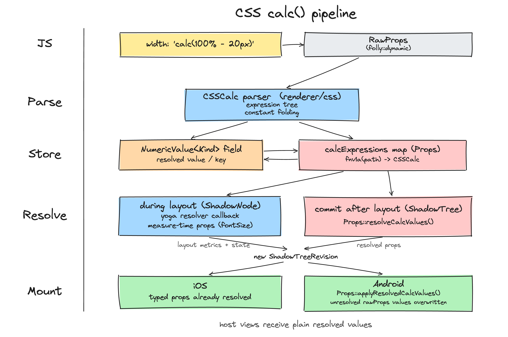

# RFC0000: CSS calc() support in React Native

## Summary

This RFC proposes support for CSS `calc()` in React Native style props. A value like `width: 'calc(100% - 20px)'` is parsed and resolved inside the C++ renderer, so host platforms receive plain numbers and do not need to know that calc exists. The feature targets the New Architecture only and sits behind a feature flag.

## Basic example

```jsx
<View style={{ width: 'calc(100% - 20px)' }} />
<View style={{ transform: [{ translateX: 'calc(50% - 8px)' }] }} />
<Text style={{ fontSize: 'calc(1.5rem)' }} />
```

## Motivation

`calc()` is a basic CSS building block on the Web. Today a value that mixes units, for example a percentage minus a fixed padding, cannot be expressed statically. The usual workaround is to measure with `onLayout` and recompute in JS. That costs an extra render pass and duplicates layout math in JS that belongs in the layout engine.

## Detailed design

The design rests on one decision: calc is handled entirely inside the C++ renderer, and host components receive resolved values. The diagram shows the pipeline.



### Parsing

A `calc()` string is parsed by a standalone parser in `renderer/css` into an expression tree. Nodes are the arithmetic operators and leaves are typed values (lengths, percentages, numbers). Unit algebra is checked at parse, for example adding a number to a length is rejected and division is allowed only by a unitless value. Constants fold at parse time, so `calc(5px + 5px)` collapses to a `10px` leaf while `calc(50% - 10px)` stays a two node tree, because the percentage cannot be resolved yet. A folded value is still tracked as calc for the Android path, because its raw string stays in the props and has to be overwritten there (see Platform delivery).

To store the result, parsing needs the node's expression map and the prop's path (the key). The map rides on `PropsParserContext`, which is built fresh per parse, so pointing it at the props under construction on that call stack is thread safe. (Routing it through the shared `ContextContainer` is not, since that object is shared per component type; an earlier attempt raced there.) The prop path reaches parsing through a calc aware parse helper that only calc capable props use, so other parsers are untouched, and with the flag off nothing changes.

### Storage and identity

Each view level `Props` holds an expression map, `calcExpressions`, keyed by a hash of the prop path (`fnv1a("opacity")` for a top level prop, `fnv1a("boxShadow.0.offsetX")` for a nested one).

A prop that can carry calc holds a `NumericValue` in place of a raw number. `NumericValue` is a typed value that is either a resolved number or a key into the map. It is generic over the value type, so `NumericValue<Length>` (aliased `LengthValue`), `PercentageValue`, `AngleValue` and so on each state what the prop accepts, and a calc of the wrong type is rejected at parse. It replaces the prop's current `Float` or `ValueUnit`. Composite value types that styles build on, such as `Point`, `Size`, and the `RectangleCorners` and `RectangleEdges` used for border radii and insets, get a calc capable variant the same way.

The keys are stable across re-parses, so two clones of the same props compare equal and layout is not dirtied without a real change. The map is held through a pointer that is null until a calc value is parsed, is immutable after parse, and is shared by clones when nothing changed. It is never cleared after resolution, because a value like `calc(1vw)` has to resolve again after events such as rotation, when no React commit touched the node. The expression is the source of truth and the resolved number is a derived output.

An app that uses no calc never allocates the map or runs the resolution pass. The one standing cost is that a prop adopted into `NumericValue` is larger than the `Float` it replaces, paid by every instance of that props class. As a rough figure, a view whose props grow by tens of bytes adds on the order of a few hundred kilobytes across a screen with a few thousand nodes.

### Interface

Both `Props` and value types like `TextAttributes` need to resolve their own calc values, and `TextAttributes` is not a `Props`. A small interface, `CalcResolvable`, declares two methods. `void resolveCalcValues(CalcResolver resolver)` runs in the commit pass and writes resolved values into the typed fields. On Android it also writes them back into the node's rawProps, which `folly::dynamic applyResolvedCalcValues(CalcResolver resolver) const` produces. The `CalcResolver` bundles the calc expressions map with the resolve context (layout metrics, viewport, and later the font sizes that `em` and `rem` need), so the interface itself stores nothing. `Props` implements it with empty defaults and adopting classes override it.

### Third party components

Custom native components generate their props through Codegen. Parsers for props that do not adopt calc are untouched, so the core work does not break third party components. Once the new `CodegenTypes` land, a library uses calc in its own props by declaring them with those types, and Codegen emits the calc aware parsing and the `CalcResolvable` methods.

### Yoga integration

Yoga gained a dynamic value handle: a length can carry a function pointer and a key in place of a fixed number. During layout Yoga calls back into RN with the node and the context it is resolving against, so RN can look up the key and return the number.

### Resolution

Values resolve at two defined points.

Layout props resolve during layout, through the Yoga callback above, so the percentage basis is the one Yoga computed. Props needed during measurement, such as `fontSize`, resolve when `layout()` runs, where the layout context is available. Both read the expression and use the result without writing it back, so the props stay immutable.

Everything else resolves in one pass at commit, right after layout. The pass clones each node that carries calc and writes resolved values into its typed fields, so the committed `ShadowTreeRevision` holds resolved values and the host receives exactly what the tree contains. A node trait lets the pass skip trees that carry no calc. For a node that does, the pass avoids reresolving when the layout inputs and the props are unchanged, so an unrelated commit does not emit an extra mount update.

### Platform delivery

On iOS the host reads the typed C++ props directly, so the resolved value is already there and nothing resolves at mount. Adopting a prop does change its type, from `ValueUnit` or `Float` to `NumericValue`, so every place that reads it, including the iOS component code, has to read the resolved value explicitly (a `.value()` accessor) rather than use the property directly.

Android is the harder case and the main open risk for shipping. The props sent to an Android view are serialized from the `folly::dynamic` rawProps that came from JS, not from the typed props, so a calc string reaching a Java setter (`setOpacity` expecting a double) would throw. The commit pass covers this: when it resolves a node it also writes the resolved numbers back into that node's rawProps, so the props serialized for a normal mount already hold numbers. A value that folded to a constant is rewritten the same way, as long as it is still marked as calc.

Preallocation of views, which runs before the commit pass while a node's rawProps, still can push to host calc strings. A calc node, marked by a trait, is preallocated with empty props and receives its resolved props when it mounts. Like everything else, this is gated by the flag.

The clean end state is Props 2.0, where Android props come from a typed C++ diff instead of the merged `folly::dynamic`. The resolved typed props are then delivered directly and the rawProps rewrite is unnecessary. Props 2.0 is a separate effort, so I didn't want v1 to depend on it.

### Animations

Animations split by driver. With the JS driver, `Animated` interpolates the calc string in JS and sends each frame to the renderer as an ordinary prop update, so it resolves like any other value and needs no extra work.

The native driver is follow up, not v1. It looks doable on the shared C++ animated backend (`useSharedAnimatedBackend`), which runs the animation graph in C++ for both platforms, but it needs more work and investigation. Two things would have to change for sure: the animated prop types (today `AnimatableNumericValue` is `number | AnimatedNode`, with no room for a calc string) and the backend's interpolation (it handles doubles now, and would need to interpolate calc strings too, then resolve them before pushing them to the host).

### Feature flag

All behavior is gated by `enableCSSCalc`, off by default. The single gate is at parse. When the flag is off a calc string is an unrecognized value and the prop is unset, which is exactly the current behavior, and nothing downstream runs.

## Drawbacks

- Adopted value fields grow in size, and that is paid by every instance of the props class whether or not the app uses calc. Keeping the old types is covered under Alternatives.
- Adopting a prop changes its C++ type, so every read site, including iOS component code, has to be updated to read the resolved value instead of a `ValueUnit` / `Float`.
- The two resolution points and the commit pass add renderer machinery that has to stay correct as other renderer work changes.
- Android runs a different delivery path from iOS until Props 2.0 lands, so there are two paths to test.
- Calc capable props parse through a calc aware helper that carries the prop path, so those props and their generated parsers change (scoped to calc props, not every parser).

## Alternatives

- **Resolve during the mount diff instead of at commit.** This skips the commit clone pass, which is its main appeal. The cost is that the committed tree keeps unresolved props while the host gets resolved ones, so committed host props would disagree with C++ props.
- **Resolve on the host platform.** This needs a separate implementation per platform.
- **Keep the existing `Float` and `ValueUnit` types.** This avoids the size growth, but a plain `ValueUnit` / `Float` have no room for an unresolved value, so it needs a sentinel and loses the guarantee that a prop is given a value of the right kind at parse.
- **Store the expression tree in the value instead of in a map.** `NumericValue` holds the tree directly, so there is no map. The value gets larger, comparing props cheaply then needs identical trees deduplicated so equality stays a pointer check (otherwise it walks the trees), and Yoga's value pool cannot hold an owning pointer, so the Yoga path still needs a side table.
- **Store calc expressions in one global map instead of per node.** Identical expressions are shared, so memory grows less and results can be cached across nodes. The cost is lifetime management and cross thread synchronization, plus plumbing the store to every parse site.
- **Attach the map to `PropsParserContext`.** It is built fresh per parse, so a per-parse `calcMap` pointer on it is thread safe. This is the plumbing the design uses.
- **Attach the map to the shared `ContextContainer`.** It is reachable from parsing too, but it is shared per component type, so a per-parse pointer on it races across threads. Wrong for that reason.
- **Fold to unit coefficients instead of a tree.** Storing calc as `{px, %, vw, vh}` is compact and cheap to resolve, but it cannot represent `min`/`max`/`clamp` or angles, so it is a dead end for later work.
- **Have attribute classes repeat the `CalcResolvable` methods instead of inheriting it.** `TextAttributes` and similar value types can declare the same methods without the interface, which avoids a vtable pointer on a small, frequently copied type. A performance option if that cost shows up.

## Adoption strategy

The feature is additive and does not break existing apps. It is New Architecture only and off by default behind `enableCSSCalc`. It would become default on in a later release once stable.

It is delivered in phases, each testable on its own:

1. Parser and Yoga. Layout props (width, margin, padding, position).
2. View paint props (opacity, transforms, borders, shadows), with commit resolution and Android delivery.
3. Text, image, and the remaining props.
4. Codegen support for third party components, plus `min()`, `max()`, `clamp()`, angle values, and the `em` and `rem` units.

## How we teach this

There is little new to teach because it is CSS. A docs page lists the supported props and states that values follow web semantics. Dev mode warnings for invalid or unsupported calc link to that page. rn-tester gets examples that toggle with the flag.

## Unresolved questions

1. **Where resolution happens.** The design resolves calc at the commit pass, after layout. Is commit the right point, or is another place in the pipeline better?
2. **Android v1.** Ship the trait based rewrite, or wait for Props 2.0 and build on its typed diff.
3. **Value type.** Adopt the new `NumericValue` type, which touches every read site and makes prop fields wider, or keep `Float` and `ValueUnit` and carry calc some other way.
4. **How the map reaches parsing.** Whether to add the map and path to `convertRawProp` / `fromRawValue` (and its exact shape, plus the compatibility path for third party overloads), or pass them another way such as `PropsParserContext`.
