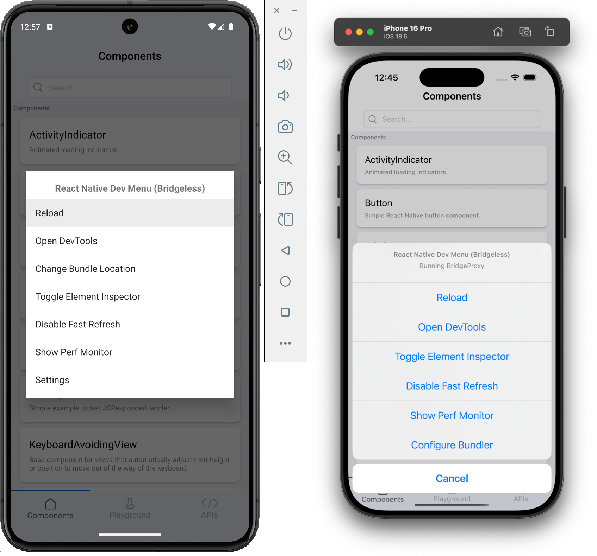

# RFC0925: New APIs to customise the DevMenu

## Summary
In this RFC, we propose a mechanism for configuring the dev menu in the following ways:
- Option to disable (and if possible, configure) the shake gesture
- Option to disable the keyboard shortcuts
- Option to disable the dev options dialog



This configuration should be possible dynamically at runtime.

This API is targeted to be utilized by frameworks.

## Motivation
This API will enable frameworks to further improve the developer experience when building apps using React Native. It will also allow for more granular control over the environment where release JS bundles are used within the debug native app builds.
In such environments, where multiple bundles can be used by the same native code, the ability to modify the configuration dynamically would be useful for disabling the dev menu when a release bundle is used, and keeping it enabled for debug bundles.

## Detailed design
### Android
We propose adding a new configuration object:
```kotlin
data class DevMenuConfiguration(
  val isDevMenuEnabled: Boolean = BuildConfig.DEBUG,
  val minNumberOfShakes: Int = 2,
  val areKeyboardShortcutsEnabled: Boolean = true,
)
```
which will be accepted as an argument by a new method on `ReactHost`:
```kotlin
fun setDevMenuConfiguration(config: DevToolsConfiguration)
```
Handling of `isDevMenuEnabled` will need to be implemented - a matching field would be required in [`DevSupportManager`](https://github.com/facebook/react-native/blob/504cf3e9330285ba8995dd938756d2ea13ffa28d/packages/react-native/ReactAndroid/src/main/java/com/facebook/react/devsupport/interfaces/DevSupportManager.kt#L25), which would then be checked [before showing the dev menu](https://github.com/facebook/react-native/blob/504cf3e9330285ba8995dd938756d2ea13ffa28d/packages/react-native/ReactAndroid/src/main/java/com/facebook/react/devsupport/DevSupportManagerBase.kt#L304). `ReleaseDevSupportManager` would always set this field to false.

Handling of `minNumberOfShakes` can rely on existing infrastructure. [`ShakeDetector`](https://github.com/facebook/react-native/blob/504cf3e9330285ba8995dd938756d2ea13ffa28d/packages/react-native/ReactAndroid/src/main/java/com/facebook/react/common/ShakeDetector.kt#L20) would need to be updated by adding a setter for the `minNumsShakes`.

Handling of `areKeyboardShortcutsEnabled` would need to be implemented - a matching field would be required in [`DevSupportManager`](https://github.com/facebook/react-native/blob/504cf3e9330285ba8995dd938756d2ea13ffa28d/packages/react-native/ReactAndroid/src/main/java/com/facebook/react/devsupport/interfaces/DevSupportManager.kt#L25). This field would be checked in the [`ReactDelegate`](https://github.com/facebook/react-native/blob/504cf3e9330285ba8995dd938756d2ea13ffa28d/packages/react-native/ReactAndroid/src/main/java/com/facebook/react/ReactDelegate.kt#L371), before dispatching the relevant action. `ReleaseDevSupportManager` would always set this field to false, which could replace the existing check in the `ReactDelegate`.

A configuration object would be passed from `ReactHost` to the `DevSupportManager` via an internal method on the latter, which will handle updating the configuration and all the listeners for the shake gesture and packager commands.
### iOS
We propose adding a new configuration object:
```objc
@interface RCTDevMenuConfiguration

@property (nonatomic, readonly) BOOL isDevMenuEnabled;
@property (nonatomic, readonly) BOOL isShakeGestureEnabled;
@property (nonatomic, readonly) BOOL areKeyboardShortcutsEnabled;

@end
```
which will be accepted as an argument by a new method on `RCTReactNativeFactory`:
```objc
- (void)setDevToolsConfiguration:(RCTDevToolsConfiguration*)configuration;
```
This optional configuration would then be passed to the `RCTHost`. From there, the setup could be the same as for [`bundleManager`](https://github.com/facebook/react-native/blob/504cf3e9330285ba8995dd938756d2ea13ffa28d/packages/react-native/ReactCommon/react/runtime/platform/ios/ReactCommon/RCTHost.mm#L245), which is passed from `RCTHost` to `RCTInstance` and is synthesizable in individual turbomodules.

Handling of `isDevMenuEnabled` can be done inside [`RCTDevMenu`](https://github.com/facebook/react-native/blob/504cf3e9330285ba8995dd938756d2ea13ffa28d/packages/react-native/React/CoreModules/RCTDevMenu.mm#L382) - when the configuration object exists and the dev menu is disabled, the method responsible for showing it could return early.

Handling of `isShakeGestureEnabled` can rely on existing infrastructure. If the configuration object exists, the default configuration of [`RCTDevSettings`](https://github.com/facebook/react-native/blob/504cf3e9330285ba8995dd938756d2ea13ffa28d/packages/react-native/React/CoreModules/RCTDevSettings.mm#L146-L147) could be overwritten.

Handling of `areKeyboardShortcutsEnabled` on the device could rely on existing infrastructure. Instead of always registering hotkey listeners in [`RCTDevMenu`](https://github.com/facebook/react-native/blob/504cf3e9330285ba8995dd938756d2ea13ffa28d/packages/react-native/React/CoreModules/RCTDevMenu.mm#L130) it could first check if the configuration exists and rely on [`setHotkeysEnabled`](https://github.com/facebook/react-native/blob/504cf3e9330285ba8995dd938756d2ea13ffa28d/packages/react-native/React/CoreModules/RCTDevMenu.mm#L473-L480). This would also mean moving logic responsible for handling reloads from [`RCTReloadCommand`](https://github.com/facebook/react-native/blob/8c305a0b64b483f376b88acf2c4be917eccbb2e9/packages/react-native/React/Base/RCTReloadCommand.m#L34-L39) to `RCTDevMenu`, where the configuration is available.

Note that because changing the configuration on iOS is done through the `RCTReactNativeFactory`, updating it at runtime necessitates creating a new `RCTHost`.

## Drawbacks
Given that this is a new API that is being added only for frameworks, we don't see drawbacks in implementing it, aside from the need to maintain it. If not used, the behavior would fall back to the default one.

## Alternatives
Expo, for example, currently does it only on Android using reflection to [replace the relevant classes](https://github.com/expo/expo/blob/b90fea77e87bb03f3c65ceeaf8913c96a7c26aff/packages/expo-dev-launcher/android/src/debug/java/expo/modules/devlauncher/react/DevLauncherDevSupportManagerSwapper.kt#L100-L114). It’s currently not done at all on iOS.

## Adoption strategy / How we teach this
As a part of the implementation, documentation for the new API will be provided with example usages to showcase how it works and explain the use cases.

## Unresolved questions

## Acknowledgements
Many thanks to Expo for raising the problem and drafting the initial RFC.
