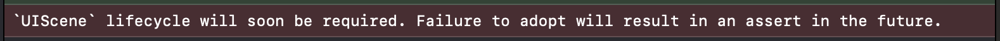
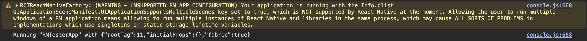
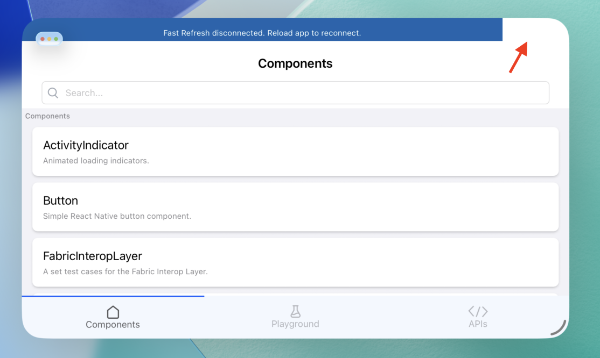
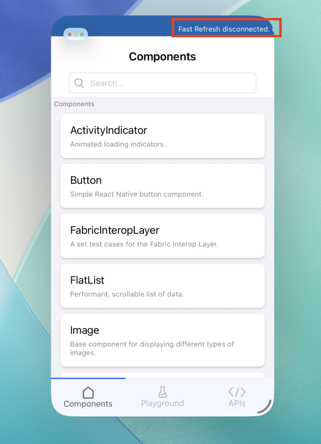
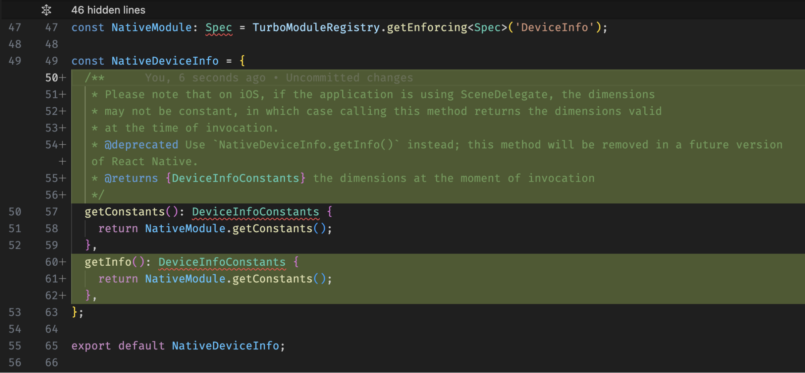

# RFC0000: [iOS] Migration to `SceneDelegate`

## Summary

iOS26 introduced deprecation of many UIApplication APIs and made `SceneDelegate` API the preferred one, notifying programmers with a warning that "UIScene lifecycle will soon be required". In future versions of iOS, `SceneDelegate` [is going to be the only supported API](https://developer.apple.com/documentation/technotes/tn3187-migrating-to-the-uikit-scene-based-life-cycle#:~:text=Failure%20to%20adopt%20will%20result%20in%20an%20assert%20in%20the%20future.) and therefore we need to start migrating to it.



It is possible to perform dynamic window resizing both via stage manager (split view) and freely via the bottom-right corner handle. `SceneDelegate` with proper configuration in `Info.plist` can enable the multi-window capability for iPadOS, which would require adjustments in RN code and RN libraries code to accommodate such design. Such a change would be large and shall be addressed in a separate RFC. The scope of this RFC is to cover a single resizable window (single instance of a given RN app), yielding the assumption that `UIApplicationSupportsMultipleScenes` **must not** be set to true at the moment. This RFC will bring in an additive change that should allow for adoption of a new `SceneDelegate` entrypoint while also allowing for (deprecated) usage of `AppDelegate`. Also, the `@react-native-community/template` and `packages/rn-tester` should be migrated to implement the `SceneDelegate` API.

One related aspect not covered by this RFC is the performance of `useWindowDimensions` hook, which during intensive resizing of the application behaves suboptimal. This matter shall be addressed in a separate RFC.

The idea proposed in this RFC is to:

1) migrate from `AppDelegate` to `SceneDelegate`  
2) educate on the need to migrate existing apps to adopt `SceneDelegate`

## Basic example

```
N/A
```

## Motivation

Support for iOS scene lifecycle APIs that are the current preferred approach for apps. The secondary reason is to remediate the problem when the `UIScene` lifecycle will become mandatory in a future release of iOS.

As an example, the following key APIs are already deprecated:

- [application:continueUserActivity:restorationHandler:](https://developer.apple.com/documentation/uikit/uiapplicationdelegate/applicationdidbecomeactive\(_:\)?language=objc) in favor of [scene(\_:continue:)](https://developer.apple.com/documentation/UIKit/UI`SceneDelegate`/scene\(_:continue:\)) \- used by RCTLinkingManager  
- [application:openURL:options:](https://developer.apple.com/documentation/uikit/uiapplicationdelegate/application\(_:open:options:\)?language=objc) in favor of [scene(\_:openURLContexts:)](https://developer.apple.com/documentation/uikit/ui`scenedelegate`/scene\(_:openurlcontexts:\)) \- used by RCTLinkingManager  
- non-UIScene lifecycle: [https://developer.apple.com/documentation/technotes/tn3187-migrating-to-the-uikit-scene-based-life-cycle](https://developer.apple.com/documentation/technotes/tn3187-migrating-to-the-uikit-scene-based-life-cycle) \- used by base application code

## Detailed design

### `SceneDelegate` `RCTReactNativeFactory` entrypoint

To support `SceneDelegate` lifecycle, a new entrypoint for RN application initialization should be provided in `RCTReactNativeFactory`, which would be invoked from `SceneDelegate` lifecycle methods. The existing entrypoint from `AppDelegate` would be kept for backwards compatibility, making this an additive change. An example code snippet of a `SceneDelegate` using React Native proposed in this RFC would be:

```objc
@interface SceneDelegate ()
@end

@implementation SceneDelegate

- (void)scene:(UIScene *)scene
    willConnectToSession:(UISceneSession *)session
                 options:(UISceneConnectionOptions *)connectionOptions
{
  if (![scene isKindOfClass:[UIWindowScene class]])
    return;

  UIWindowScene *windowScene = (UIWindowScene *)scene;
  self.window = [[UIWindow alloc] initWithWindowScene:windowScene];

  ReactNativeDelegate *delegate = [[ReactNativeDelegate alloc] init];
  RCTReactNativeFactory *factory = [[RCTReactNativeFactory alloc] initWithDelegate:delegate];

  self.reactNativeDelegate = delegate;
  self.reactNativeFactory = factory;

  [factory startReactNativeWithModuleName:@"TestApplication"
                                 inWindow:self.window
                        initialProperties:[self prepareInitialProps]
                        connectionOptions:connectionOptions];
}

- (void)scene:(UIScene *)scene openURLContexts:(NSSet<UIOpenURLContext *> *)URLContexts
{
  [RCTLinkingManager scene:scene openURLContexts:URLContexts];
}

- (void)scene:(UIScene *)scene continueUserActivity:(NSUserActivity *)userActivity
{
  [RCTLinkingManager scene:scene continueUserActivity:userActivity];
}

@end
```

### Migration from `AppDelegate` to `SceneDelegate`

Adoption of `UIScene` lifecycle requires the following actions:

* In application base code  
  * migration from `AppDelegate` as the primary point of lifecycle-related logic to `SceneDelegate`; for backwards compatibility, RN public API integration points will still be compatible with `AppDelegate` approach for users that may not want to migrate immediately  
  * invoke RN `RCTLinkingManager` methods from `SceneDelegate`:  
    * `scene:continueUserActivity:`
    * `scene:openURLContexts:`
  * update of the app's Info.plist to include a `UIApplicationSceneManifest` specifying the support and disabling multiple scenes capability  
* In React Native code:  
  * migration of code that relies on `launchOptions` and deprecated `UIApplicationLaunchOptions`\* keys to `UIScene` lifecycle and `UIScene.ConnectionOptions.userActivities`
* In React Native code, RN native libraries’ code:  
  * migration of app lifecycle methods from application\* to scene\* as per [https://developer.apple.com/documentation/technotes/tn3187-migrating-to-the-uikit-scene-based-life-cycle](https://developer.apple.com/documentation/technotes/tn3187-migrating-to-the-uikit-scene-based-life-cycle)  
  * migration of code that relies on *any* *deprecated* `AppDelegate`-related APIs, which detailed description of is presented below

To enforce the user not to enable the `UIApplicationSceneManifest`.`UIApplicationSupportsMultipleScenes` capability in `Info.plist`, from now on, the following warning would be printed from `RCTReactNativeFactory` provided the user had enabled the multi-window capability:



#### Migration: RN app template, RNTester

In case of the RN app template, the iOS boilerplate code is limited only to basic bootstrapping of the application. This implies adjustments to:

* `Info.plist` \- add support for `SceneDelegate`  
* `SceneDelegate.mm` \- implement the `SceneDelegate`  
* `AppDelegate.mm` \- move app bootstrap code from here to `SceneDelegate.mm`

#### Migration: inspect usages of `RCTReactNativeFactory`

Support methods for initializing React Native from `SceneDelegate`’s lifecycle methods.

#### Migration: `RCTLinkingManager`

The linking manager is using `AppDelegate` methods for handling URLs being opened at runtime. This needs to be migrated to `SceneDelegate`. To maintain backwards compatibility, we can implement both approaches and \- to ensure that only one is invoked at a given time \- conditionally check if the app is based on `AppDelegate` or has scenes to ensure only one listener handles the event. The Scene lifecycle options (`NSDictionary`) are adapted to the format of `AppDelegate` launchOptions (`NSDictionary` as well).

#### Migration: RCTDevLoadingView

The does not account for updating the overlay `UIWindow` constraints so it does not get resized along with the main window. The proposed fix is to update the constraints based on KVO observation of the main window’s frame.




#### Migrating Dimensions: internal state adjustment & naming convention

Dimensions currently are exported as a constant. Such design does not fit the concept of resizable windows. To accommodate this, `RCTDeviceInfo` (iOS native module) should update its internal state variable upon changes to the frame so as to make `getConstants` return a value that is up-to-date at the time of invocation.

`Dimensions` (JS API) contains a `getConstants` method that wraps the native `getConstants` method and caches the result internally. The caching would now be obsolete (since the value may change in time), therefore the underlying native method should always be invoked. Moreover, the naming of the JS `getConstants` method in face of resizable windows may be misleading, since from now on the dimensions are not constant. Therefore, I propose a gradual adoption of a new method of same functionality, `getInfo()`, along with the deprecation of `getConstants()`, on the JS API side. A rough draft of the JS API changes would be:  



## Drawbacks

### Migration from `AppDelegate` to `SceneDelegate`

- In React Native source and RNTester: will be covered by the PR following this RFC  
- In user RN applications using `UIApplicationSupportsMultipleScenes=NO`: adjusting Info.plist and the entrypoint according to the upgrade helper diff  
- In user RN applications using `UIApplicationSupportsMultipleScenes=YES`:  
  - Ones not using native code:  
    - adjusting `Info.plist` and the entrypoint according to the upgrade helper diff  
    - ensuring that consumed libraries work well in multi-instance setups   
  - Ones using native code:  
    - the above  
    - migrating from `AppDelegate` lifecycle methods to `UIScene` lifecycle methods  
    - inspecting usage of singletons & static fields to ensure they logically fit the multi-instance reality  
- In RN libraries:  
  - migrating from `AppDelegate` lifecycle methods to `UIScene` lifecycle methods  
  - inspecting usage of singletons & static fields to ensure they logically fit the multi-instance reality

## Alternatives
What other designs have been considered? Why did you select your approach?

## Adoption strategy

This would be a breaking change for apps referencing `AppDelegate`-related APIs (such as lifecycle / obtaining the window instance) or using libraries that do so. For users that do not use the aforementioned, this change would not be breaking. Third-party libraries that made use of `AppDelegate`-related APIs should migrate to UIKit scenes-related APIs to work properly with multiple scenes.

## How we teach this

For use cases not featuring native code, the migration should follow the RN upgrade helper diffs to adapt native app code.

For use cases featuring native code, the migration will additionally require migrating to UIKit scenes-related APIs.

We should also mention APIs referenced in RN code that were used with `AppDelegate` and were migrated as examples:

- `UIScreen.mainScreen.bounds.size` ->  `RCTKeyWindow().bounds.frame.size`  
- `RCTSharedApplicatiorean.delegate.window` -> `RCTKeyWindow()`
