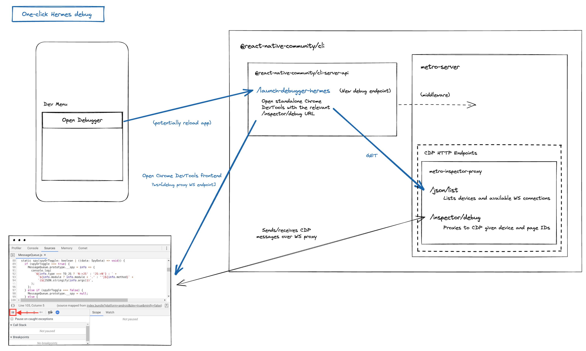

# RFC0641: Decoupling Flipper from React Native core

## Summary

We are planning to update the React Native app template to no longer use Flipper by default, and replace Flipper's JS debugging experience with an equivalent one-click debugging flow. This intends to simplify and improve the debugging and upgrade experiences for React Native developers.

It is important to emphasise that Flipper as a product will remain available; only its integration with React Native will no longer be enabled out-of-the-box. We aim to provide a transition process for those who choose to maintain their own integration with Flipper, by externalising this as a separate package.

We encourage React Native contributors to review this document thoroughly and to share your thoughts, ideas, and concerns.

## Motivation

The React team has invested considerable time into understanding the pain points React Native developers are experiencing when developing their applications. Through this research, the top issue highlighted by our users and core contributors was the debugging experience, particularly Flipper ↔ React Native debugging.

Feedback focused on four main areas:

- Instability of the debugging experience with Flipper, frequent crashes, and difficulty performing even core workflows such as initial installation / connection to the host application.
- The performance of the Flipper debugging experience and its user interface responsiveness was subpar compared to all other tools in the RN developer toolchain.
- Flipper had been historically slow in addressing issues needed for the Flipper experience in React Native.
- Flipper adds a number of transitive dependencies on both Android & iOS which is making build times longer and adds complexity to the release process.

The React Native and Flipper teams spent time at the beginning of 2023 trying to find a way to address these issues and fund this work. However, it quickly became clear that the capacity of the Flipper team is prohibitive to them taking on an active role in addressing issues in React Native for Flipper.

After careful analysis and to provide our users with the best developer experience, the React team has put together this proposal to decouple Flipper from React Native and deliver to the community a simple debugging solution relying on industry-standard protocols and tooling (which we can build upon further in future).

The React team is fully aware that a number of our partners are invested in Flipper, and we will be working with the community to find a model that will allow a willing partner or larger ecosystem to take ownership of Flipper for React Native.

## Goals

- **Community feedback**: Validate that we have covered the main React Native use cases of Flipper in this proposal.
- **Decouple from Flipper**: Remove the built-in native Flipper integration from the template in React Native 0.74.
- **One-click Hermes debug**: Ship a new default JavaScript debugging experience under Hermes by directly launching from the Dev Menu into Chrome DevTools.
- **[Stretch] Docs improvements**: Expand our docs for native debugging to recommend alternative tools for native Flipper plugins (i.e. guidance for using Android Studio and Xcode Instruments).

## Detailed design

### Removal of native Flipper integration from the template

The native integration code for Flipper currently takes up a significant effort out of our release process and general maintenance of React Native.

As part of this proposal we will announce the deprecation of first-party support for Flipper in 0.73 and **no longer install Flipper** for newly created apps starting from 0.74 — removing all Flipper related code from the new app template.

Here are some alternatives we're evaluating on how to handle the Flipper integration.

#### 1. Create a separate library and look for a maintainer

Our preferred alternative is to create a `@react-native-community/flipper-integration` library that will encapsulate and handle the Flipper integration for our users. [Flipper configuration files](https://github.com/facebook/react-native/blob/main/packages/react-native/template/android/app/src/debug/java/com/helloworld/ReactNativeFlipper.kt) from the template should be moved there.

This library should ideally be agnostic of both the React Native version and the Flipper version, so we foresee a low maintenance cost.

**If you're interested in maintaining this library, please let us know.**

#### 2. Create a module inside React Native to encapsulate the integration code

Should we be unable to find a maintainer, we could encapsulate all the template logic (i.e. [files in user space](https://github.com/facebook/react-native/blob/main/packages/react-native/template/android/app/src/debug/java/com/helloworld/ReactNativeFlipper.kt)) into a separate module inside the React Native repository. For instance for Android, the library would live inside `packages/react-native/ReactAndroid/flipper/` or `packages/react-native-flipper-android/`.

This package would still be published as part of the React Native release workflow, but will **not** be used by default by the app template. Users will be able to enable it with a one-line configuration if needed (or via autolinking).

#### 3. Drop entirely and refer users to official Flipper documentation

As a last resort, we can point users to the documentation of the Flipper website (which should be reviewed) and would replicate the current template setup:  
https://fbflipper.com/docs/getting-started/react-native-android/  
https://fbflipper.com/docs/getting-started/react-native-ios/

### New "Open Debugger" flow: One-click Hermes debug

To replace the current Flipper-based "Open Debugger" flow in the Dev Menu (Hermes only), we will introduce a minimal one-click flow that connects the Hermes debugger endpoint with a local Chrome (or Microsoft Edge) DevTools instance. This is similar to the old way we allowed debugging React Native apps, but will now work with Hermes, connecting directly to the device to debug your app.

This will become the new default experience for direct JS debugging in apps using Hermes, and will remove the requirement of having Flipper set up on a developer machine to reach this core debugging capability.

We plan to implement this experience in React Native CLI via a new `/open-debugger` endpoint. This replaces the current "Open Debugger" flow (which attempts to open Flipper via a `flipper://` URL scheme and fails otherwise).

Since this new debugging flow fills a gap when users do not have Flipper installed, we aim to add this logic against the "Open Debugger" button by default — replacing previous `flipper://` URL actions in the Dev Menu.

### Replacing "Open React DevTools"

We will also aim to replace the “Open React DevTools” flow in the Dev Menu, via a similar endpoint in React Native CLI that opens the standalone React DevTools app (or in a browser window). This is less of a priority than the above, as today we have a [standalone React DevTools connection flow](https://reactnative.dev/docs/next/react-devtools) that works without this button.

### Documenting alternative existing native debugging tools

We understand that Chrome DevTools alone won't replace the functionality of the current suite of Flipper native debugging plugins, and will be supporting this by improving our docs on debugging with first-party native debugging tools.

- [Crash Reporter](https://fbflipper.com/docs/features/plugins/crash-reporter/) — Android Studio/Logcat and Xcode
- [Databases Plugin](https://fbflipper.com/docs/features/plugins/databases/) — [Android Studio](https://developer.android.com/studio/inspect/database)
- [Network Plugin](https://fbflipper.com/docs/features/plugins/network/) — [Charles Proxy](https://www.charlesproxy.com/documentation/configuration/browser-and-system-configuration/), [mitmproxy](https://medium.com/@rotxed/how-to-debug-http-s-traffic-on-android-7fbe5d2a34#.hnhanhyoz) (Android), [Fiddler](https://www.telerik.com/fiddler), [Chucker](https://github.com/ChuckerTeam/chucker)
- [Shared Preferences Viewer](https://fbflipper.com/docs/features/plugins/preferences/) — TBC
- [UI Debugger Plugin](https://fbflipper.com/docs/features/plugins/ui-debugger/) — Android Studio and Xcode

### Note: This is not the end state for React Native debugging

We acknowledge that the "Open Debugger" and "Open React DevTools" flows previously launched Flipper, which offered the promise of a cohesive, easy to teach, and extensible experience for users. From that perspective, these proposed changes aren’t strictly better.

We see this — decoupling from Flipper to simplify React Native core and reset the baseline reliability of the debugging experience — as one of the first steps in our journey to up-level the debugging experience for React Native developers.

The React Native and Hermes teams are committed to continue our investments in this area. We hope to ship improvements to CDP support for Hermes and enhancements to the debugging experience by establishing a stable foundation for seamless communication between the application at runtime and debugging clients (such as Chrome DevTools Frontend).

## Adoption strategy

We aim to complete this work within the next two React Native development cycles. This is motivated by unburdening the React Native release crew from Flipper-introduced overheads, balanced with giving developers and library maintainers time to adopt and migrate.

Additionally, this gives us time to ship further debugging improvements on top of the Chrome DevTools flow we will deliver in 0.73.

### Target release for deprecation: React Native 0.73 (Q3 2023)

- The native Flipper integration remains in the template and enabled by default.
- The new Chrome DevTools-based debugging flow is shipped and replaces the "Open Debugger" and "Open React DevTools" actions in the Dev Menu. Flipper must be opened separately to connect to a running React Native app.
- Flipper will no longer be recommended as the default debugging tool for React Native — except for compatibility with today's Flipper plugins.

### Target release for removal: React Native 0.74 (Q4 2023/early 2024)

- The native Flipper integration is no longer present in the template. Developers must follow manual setup steps from the Flipper docs to install Flipper in new React Native projects.
    - If we've found an owner to maintain the React Native Flipper integration, this may be a simpler case of adding and linking a `@react-native-community/flipper-integration` library.

## How we teach this

### General communication

> It is important to emphasise that Flipper as a product will remain available; only its integration with React Native will no longer be supported out-of-the-box. 

- Highlight the availability of the new one-click Hermes debug experience.
- Communicate that Flipper is no longer the default recommended tool.
- Highlight the ability to re-integrate Flipper via new external library.

### User guide for re-integrating Flipper

- We'd like a partner to own this.
- Can live on the React Native website or in the README of the separate repo.
- Document the availability of this prominently in the React Native changelog.
