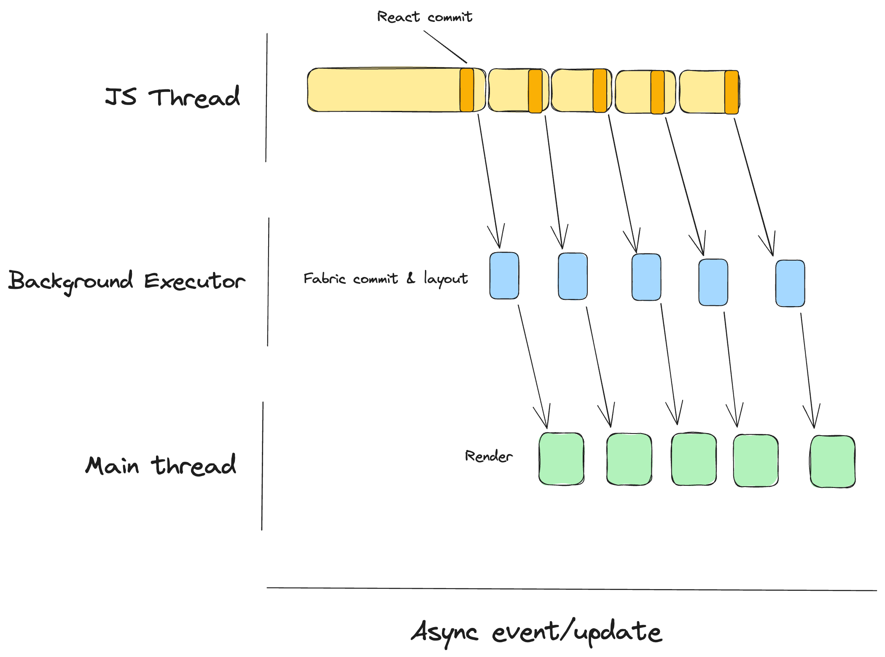
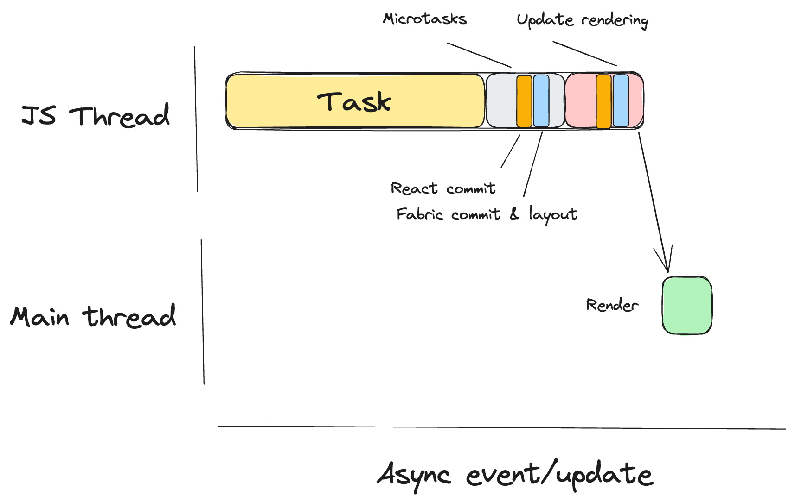
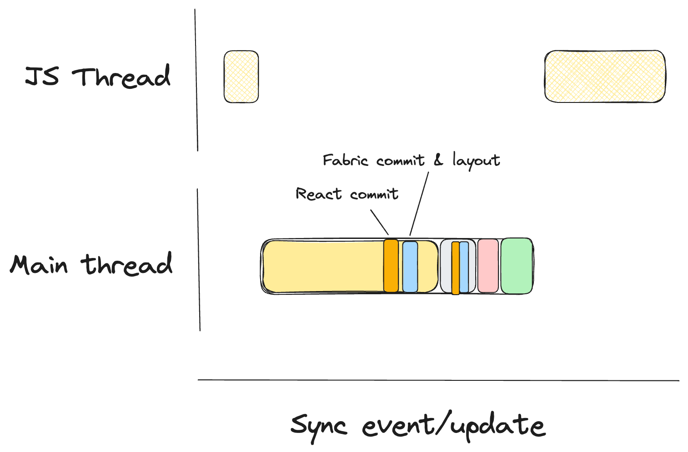

# RFC0744: Well-defined event loop processing model

## Summary

This is a proposal to formalize the steps that React Native follows to perform tasks on the JavaScript thread, and how that work is synchronized with rendering work in the host platform.

The main goals are:
* Make the behavior of the framework more predictable, to help developers build more reliable and performant apps.
* Increase the alignment with Web specifications, to simplify the adoption of Web APIs in React Native.
* [Secondary] Provide a solid foundation for general performance optimizations relying on better scheduling or sequencing.

The scope of this proposal is restricted to:
* Apps using the new React Native architecture.
* Existing features and APIs in React Native. Even though the Web defines steps for APIs that we want to eventually adopt in React Native (like `ResizeObserver`), those are out of the scope of this proposal and will be considered as a future extension.

This proposal is heavily inspired by the [event loop processing model defined in the HTML specification](https://html.spec.whatwg.org/multipage/webappapis.html#event-loop-processing-model), bringing only the concepts that are useful for React Native.

**_NOTE: When we talk about how React Native works in this document we are only referring to the new architecture._**

## Basic example

This proposal does not introduce new APIs but changes the behavior of some of the existing ones.

The most important changes are:
* Refs, layout effects and passive **effects** in React components would have **access to layout information synchronously** and would **block paint** until completed (except on passive effects for async updates). At the moment, React Native executes effects and computes layout in parallel, so users have no guarantees about their sequencing.
* Microtasks would be properly supported, instead of being polyfilled using timers. They would also block paint as they do on the Web.

Examples:
* Synchronous access to layout information:
    ```javascript
    function MyComponent(props) {
        const ref = useRef();

        // Via effects
        useLayoutEffect(() => {
            // Using the new DOM APIs
            console.log('Client rectangle is', ref.current.getBoundingClientRect());

            // Using the legacy measurement APIs
            let rect;
            ref.current.measureInWindow((x, y, width, height) => {
                rect = new DOMRect(x, y, width, height);
            });
            console.log('Client rectangle is', rect);
        }, []);

        return (
            <>
                <SomeView ref={ref} />
                <SomeOtherView
                    ref={element => {
                        // Via ref callback
                        console.log('Client rectangle is', element.getBoundingClientRect());
                    }}
                />
            </>
        );
    }
    ```
* Atomic UI updates:
    ```javascript
    function MyComponent(props) {
        const [width, setWidth] = useState(0);

        useLayoutEffect(() => {
            // We would also wait for this update before painting to the screen,
            // Instead of having multiple updates causing flicker.
            setWidth(ref.getBoundingClientRect().width);
        }, []);

        return (
            <>
                <SomeView ref={ref} />
                <OtherComponent width={width} />
            </>
        );
    }
    ```

## Motivation

The main motivation for this proposal is to **fix a series of problems** in React Native that prevent it from **implementing the React programming model correctly**. This programming model defines a series of abstractions and assumptions that developers can rely on to build applications, independently of the platforms they are targeting. If you look at the [React documentation](https://react.dev/reference/react), everything under the `react` package (not in `react-dom`) should work the same way across platforms.

That’s not the case for hooks like `useLayoutEffect`. From [its documentation](https://react.dev/reference/react/useLayoutEffect):
* _useLayoutEffect is a version of useEffect that fires before the browser repaints the screen_
    * Forgiving their mention to the browser, in React Native `useLayoutEffect` is not guaranteed to run before repainting the screen.
* _Call useLayoutEffect to perform the layout measurements before the browser repaints the screen_
    * In React Native, layout effects can fire before layout information has been computed, so accessing layout information can provide stale or incorrect data.
* The code inside useLayoutEffect and all state updates scheduled from it block the browser from repainting the screen
    * Again, this is not the case in React Native. The tree for which we are processing effects is mounted in parallel in the host platform.

The main goal of this hook is to allow multi-pass renders without causing UI thrash, and this goal is not accomplished in React Native with its current semantics.

Another important motivation for this proposal is to **increase alignment with the Web platform**. The Web provides capabilities that are often necessary to build high quality applications. With this proposal, bringing APIs related to rendering with the right semantics, like `IntersectionObserver` and `ResizeObserver`, becomes easier, which also simplifies sharing code across these platforms.

For example, `ResizeObserver` callbacks run after tasks and microtasks have been executed, but before the browser repaints the screen. If we want to be able to bring code from the Web into React Native using this API, we need to follow the same semantics, or otherwise users could find behavior differences or bugs.

Finally, by having a well defined processing model for the event loop, we can rely on the guarantees it provides to **implement optimizations**, both in applications and in the framework itself. For example, we could move layout events (via `onLayout`) to be dispatched as microtasks, so we can batch them with the original changes that triggered them, reducing UI thrash and potentially eliminating mounting instructions from React to the host platform. We can also rely on this processing model to efficiently implement events that are processed synchronously from the main thread.

## Detailed design

### Conceptual model

#### Current conceptual model

The most important change that this proposal would introduce is the order of execution of `useLayoutEffect`, `useEffect` and mounting the changes in the host platform (what would be considered “repaint” in Web browser terms).

At the moment, after every commit in React, this happens **in parallel**:
* **React** propagates refs, mounts effects (executes `useLayoutEffect` callbacks and lifecycle methods like `componentDidMount` and `componentDidUpdate`) and mounts passive effects (synchronously or in a microtask, depending on the priority of the current rendering work), in that order.
* **The React Native renderer** schedules a task in a background thread to commit the new UI tree and compute its layout. When that is completed, the host platform is notified to mount the changes in the main thread.



This has 2 important consequences that make React Native behave differently than React DOM:
1. Layout information might not be available when executing layout effects, as there are no synchronization mechanisms for it.
2. Paint is not blocked on effects in React, so intermediate UI states could be flushed to the host platform and shown to the user.

In this proposal, those differences would be removed and React Native would behave the same way as React DOM, while preserving the advantages of its threading model.

#### New conceptual model

The new model would be **more aligned with [the model on the Web](https://html.spec.whatwg.org/multipage/webappapis.html#event-loop-processing-model)** (from which we will borrow some concepts and steps), while **still benefiting from the React Native threading model**.

This would introduce an event loop processing model for React Native, which will precisely describe the sequencing between JavaScript execution and rendering.

This event loop would continuously go through these steps:
1. Select the next task to execute among all tasks waiting for execution.
2. Execute the selected task.
3. Execute **all** scheduled microtasks.
4. Update the rendering.



One of the key benefits of this model is that each **event loop iteration represents an atomic UI update**. This helps reason about whether work scheduled within a specific task should be rendered together or not. If it is a step in the same task, scheduled as a microtask or one of the specific sub-steps in updating the rendering, then it will be atomic. Otherwise, if it was scheduled as a separate task (e.g.: using timers, native callbacks, etc.) it would constitute a separate UI update.

##### Detailed steps

###### 1. Task selection

On the Web, task selection is an implementation detail left to browsers to decide.

In React Native, there is already a Runtime Scheduler that supports the execution of tasks with priorities, so we can rely on it for task selection. The criteria it is currently using is:
1. If there are expired tasks, select expired tasks in the order in which they expired.
2. Otherwise, select tasks by priority, in the order in which they were scheduled.

The Web spec defines the concept of task queues as a mechanism to ensure that certain types of tasks execute in a specific order (e.g.: events). We already have the concept of event queues in React Native that serve the same purpose and we can continue using it after this.


###### 2. Task execution

The way we execute tasks would not change after this change. It would continue being the execution of a C++ function that accesses the JS runtime to perform its logic.

###### 3. Microtask execution

In this step we would drain the microtask queue, executing all the microtasks in order. A microtask can schedule additional microtasks, so incorrect product logic could lead to an infinite loop here. This is expected and it is the same behavior it has on the Web.

###### 4. Update the rendering

The last step is to check if the previous work produced new commits in Fabric. If that was the case, we would notify the host platform that it should apply the necessary mutations to reach that state.

In the future, we could extend this step to do more of the work that browsers do. For example, we could run resize observations here, or update animations and run animation frame callbacks.

##### Synchronous execution, events and rendering

Formalizing this event loop that synchronizes with rendering also allows us to efficiently implement synchronous events.

The main problem to implement synchronous events with the existing model is that we do not know which tasks should be processed together to be rendered atomically. This means that we could end up executing too little JavaScript code in the UI thread, leading to an unfinished UI state, or too much, leading to blocking the UI thread for longer than necessary, negatively impacting responsiveness.

The benefit of this model is that it defines what is the unit of work that leads to a full UI update, which means we know exactly how much code to execute in the UI thread. In this case, we would only go through a single iteration of the event loop, which would provide those guarantees.



### Implementation

#### Event Loop

To preserve the semantics of the event loop defined here, we need to make sure all JS tasks execute through it. Both in the old and in the new architecture, all tasks are scheduled through a `RuntimeScheduler` instance, which implements a priority queue on top of the message queue exposed by `RuntimeExecutor`. We could build our event loop processing logic inside that abstraction.

The current `RuntimeScheduler` implementation has a few limitations that we should address as part of this effort (e.g.: not being able to schedule work outside of the JS thread with custom priorities or avoiding asking the current task to yield).

After that, we need to extend the implementation to implement the steps in the loop:
* To add support for microtasks, we would need to execute them after executing the main work of the task. Additional work is required in the JS runtime to enable native microtasks (exposing the `queueMicrotask` function and relying on them for promises) and in React (enabling microtasks for scheduling/batching).
* To prevent React commits to be mounted on the host platform before the “Update the rendering” step in the loop, we would need to avoid notifying the <code>[SchedulerDelegate](https://github.com/facebook/react-native/blob/c95b2d97281b32cf00490be8d8f9358acfa000c1/packages/react-native/ReactCommon/react/renderer/scheduler/SchedulerDelegate.h#L28C35-L28C35)</code> about these commits and wait for this step to notify all pending changes. In <code>RuntimeScheduler</code>, we could expose a new API to queue these notifications (e.g.: <code>scheduleRenderingUpdate</code>) from the React Native <code>[Scheduler](https://github.com/facebook/react-native/blob/c95b2d97281b32cf00490be8d8f9358acfa000c1/packages/react-native/ReactCommon/react/renderer/scheduler/Scheduler.cpp#L307)</code>.

#### React renderer updates

The React reconciler uses microtasks for batching updates and to schedule paint-blocking work, if they are available. The React Native renderers (Fabric) [is configured as not having support for microtasks](https://github.com/facebook/react/blob/bb1d8d166799eb97892be6c7826179270ba283d0/packages/react-native-renderer/src/ReactFiberConfigFabric.js#L125), so the reconciler falls back to [using a scheduler function to schedule tasks with immediate priority](https://github.com/facebook/react/blob/bb1d8d166799eb97892be6c7826179270ba283d0/packages/react-reconciler/src/ReactFiberRootScheduler.js#L491). We would need to add a feature flag in React to enable the use of microtasks in Fabric.

#### Background executor

The new React Native renderer (Fabric) provides an option to commit React trees in a background thread, doing layout, mount, etc. asynchronously, outside of the JavaScript thread. This option was provided to offset some of the performance regressions that Fabric introduced due to the increased amount of work that it performs in the JavaScript thread. Unfortunately, it is also the main reason why `useLayoutEffect` does not have the correct semantics in React Native. As part of this proposal, that option and the background executor would be removed.

## Drawbacks

This would introduce changes in the semantics of existing applications. We expect these to be transparent for end users in most cases, but applications relying on the ordering or timing of specific events could be affected by this. See the _Adoption strategy_ section for more details.

## Alternatives

None considered that would accomplish the same goals. We define a custom processing model for React Native, but that would not achieve the goal of aligning with Web standards.

## Adoption strategy

Ideally we would **ship this as part of the new React Native architecture**. We expect users to thoroughly test their applications when migrating to the new architecture to make sure everything works as expected. If we shipped these changes as part of the new architecture, users would not need to do another round of testing for this specific feature. This might increase the number of differences between the old architecture and the new one, but the cost of identifying and fixing potential problems at this point should be lower than doing it separately.

If these changes are not ready by the time we are ready to roll out the new architecture, this could be rolled out gradually using a feature flag. We could introduce this flag in a minor version of React Native and make it the default in the following major version.

## How we teach this

There is currently very little documentation about the current processing model in React Native. We have [some documentation about the new architecture](https://reactnative.dev/architecture/fabric-renderer), but it only covers the integration between React, React Native and the host platform at the React commit level, but it does not talk about how it coordinates with JavaScript execution.

We could fill this void by referencing existing documentation for the event loop on the Web, and pointing out specific differences between the Web and React Native. For developers with a Web background, documentation might not even be necessary (as the actual behavior would align with their expectations).

## Unresolved questions

* Add an example (code snippet and/or video) that shows how multi-pass updates look like before and after this proposal.
* What are examples of behavior changes we could expect from this change?
  * We are currently testing these changes at Meta and we will be able to update this document as we learn from it.

## Future extensions

* Implementing synchronous execution/**synchronous events**, leveraging the event loop to know how much code we need to execute in the main thread (a single iteration of the event loop).
* Modifying **layout events** (`onLayout` in native components) to be dispatched **using microtasks** in the same task where the commits happen, instead of as separate tasks. This would improve performance (as we would reduce the frequency of diffing and the number of mounting instructions) and UX (as we’d paint the original commits and any work done in `onLayout` atomically.
* We have been testing implementations of a subset of `IntersectionObserver` and `MutationObserver`. After this proposal is implemented, we could modify those implementations to bring them closer to the Web specification (e.g.: using microtasks for `MutationObserver` callbacks, computing intersections in the “Update the rendering” step, etc.).
* Implementing spec-compliant versions of `requestAnimationFrame`, `requestIdleCallback`, Long Task API, Event Timing API, etc.
* Implementing lazy layout computation, to bring some of the benefits of Background Executor with the semantics defined in this document.

## Changelog

| Date | Author | Change |
|---|---|---|
| 2023-12-11 | [Rubén Norte](https://github.com/rubennorte) | Initial version published |
