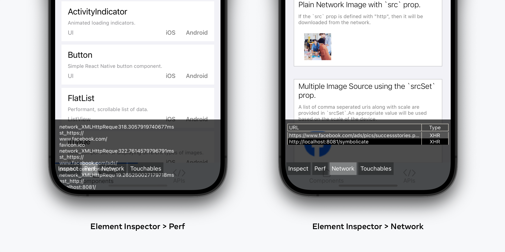

# RFC0777: Removing the "Perf" and "Network" tabs from the in-app Element Inspector

## Summary

This RFC identifies two sub-features of the in-app Element Inspector which we believe are **not worth reimplementing** under the New Architecture.

## Motivation

As the React team focuses on the New Architecture and Debugging, we are reviewing the current development tooling we offer.

The in-app Element Inspector is a longstanding development feature in React Native, which helps developers visually understand the element hierarchy in their app via tap interaction and through its React DevTools integration. However, its UI also houses some adjacent features which are unrelated to this purpose, are ambiguous with other built-in tools, and have been little-maintained.

As we build out the New Architecture, we need to consider the usefulness of these features and the cost of adapting and maintaining these against the Bridgeless model. So, we are considering the removal of both the **Perf** and **Network** features under the Element Inspector overlay, under the New Architecture.

- Under the current architecture: Leave these features in place.
- Under the New Architecture: Do not reimplement these features, removing the "Perf" and "Network" buttons.

## Detailed design

### Legacy features to remove

#### 1. Element Inspector > Perf

Functionality: Textual logs of network requests with request duration. Non-interactive, no scrolling.

A "Perf" tool here is ambiguous with the "Perf Monitor" feature we provide in the Dev Menu (which displays a standalone performance overlay), additionally motivating its removal.

#### 2. Element Inspector > Network

Functionality: A table view of HTTP requests made from the application. Non-interactive.

### Replacing these features

The functionality and value of both of these tabs is limited, providing basic visibility into network events. We believe there is better tooling, both today and in our future Debugging plans, that encapsulate these offerings.

- Replacement tooling (today): native network inspectors (e.g. Charles Proxy), Network panel (web), console logs.
- Replacement tooling (future): Fully functional Network panel in Chrome DevTools (**available in Expo today**).

## Adoption strategy

None, remove these features for the New Architecture.

## How we teach this

In a future release announcement that includes the full New Architecture by default, note this change.
