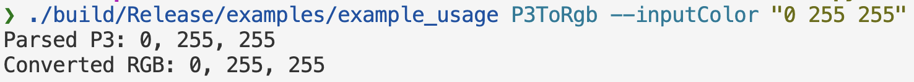
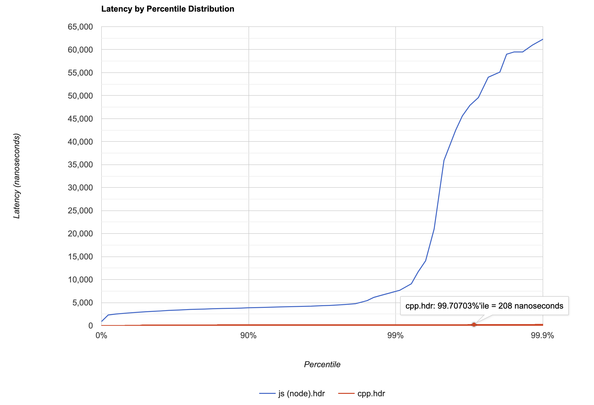

# Add the OkLab color space to React Native

## Summary

React Native currently only supports RGB color space, we want to add OkLab support.

RGB is historically based on TV technical requirements where there are 3 colors for cathode ray tubes: red, green, blue. Therefore, it does not correspond to the human eye and is not suitable for computation.

OkLab color space is a **perceptual color space**, which means it is able to predict lightness, chroma and hue as the human eye does, and it is also better for computation. As an example, OkLab produces smoother gradients than RGB:

| OkLab                                                                                                                                                                                         | RGB                                                                                                                                                                                                                                   |
| --------------------------------------------------------------------------------------------------------------------------------------------------------------------------------------------- | ------------------------------------------------------------------------------------------------------------------------------------------------------------------------------------------------------------------------------------- |
|  <sup>OkLab varying hue (chroma, constant lightness)</sup> | <sup>RGB varying hue (chroma, constant lightness)</sup>                                                |
|                                                                                                                                                                                               |  <sup>Conversion of RGB gradient to grayscale using OkLab demonstrates the discontinuity of lightness of RGB.</sup> |

In short, it means it’s better than RGB to properly handle colors.

This proposal discuss adding support for this color space in React Native, covering:

- JS API
- Native API
- Platform changes

## Basic example

### JS API

`OkLch` has the same `L` (perceived lightness) axis as OkLab, but uses polar coordinates for `C` (chroma) and `H` (hue). It is the preferred form of user input:

> 📖 The syntax is inspired by [CSS4 Color standard](https://www.w3.org/TR/css-color-4/#specifying-oklab-oklch).
> It supports different values for compatibility and developer experience.
> | OkLch accepted values | OkLab accepted values |
> | - | - |
> | `oklch(0.70 0.12 180)` | `oklab(0.7 -0.12 0)` |
> | `oklch(70% 30% 180deg)` | `oklab(70% -30% 0%)` |
>
> These colors are all the same and represent:
>
> 

In a React Native component, it will look like this:

```tsx
const MyComp = () => (
  <View style={{ backgroundColor: "oklch(0.66 0.3 120)" }}>
    <Text style={{ color: "oklch(0.72 0.2 260)"  }}>
  </View>
)
```

<sup>_Example of an “oklch(L C H)” function_</sup>

### Native API

This API will be internal to React native: it will help improve existing API, like P3 support

It may be exposed to JSI or NativeModules, to be used by community.

```cpp
using namespace facebook::react;

// Define color 1
SharedColor c1_p3 = colorFromComponents(ColorComponents{1, 0, 0.5, 1, ColorSpace::P3});
SharedColor c1_oklab = toOklab(&c1_p3); // ⬅️ new API

// Define color 2
SharedColor c2_p3 = colorFromComponents(ColorComponents{0, 1, 0.2, 1, ColorSpace::P3});
SharedColor c2_oklab = toOklab(&c2_p3); // ⬅️ new API

// perform some interpolation logic
// Eg:
SharedColor c_oklab = x * c1_oklab + (1 - x) * c2_oklab

// Perform the gamut mapping to **sRGB** as the user device only support sRGB
SharedColor color_sRGB  = gamutMapTo(&oklab, ColorSpace::sRGB); // ⬅️ new API
```

<sup>_An example of color interpolation + gamut mapping_</sup>

## Motivation

There are five motivations for adding OkLab support in React Native.

### **Allowing code using P3 colors to be run on non-P3 devices**

P3 is a wider color space made by Apple that is used on Retina displays.

React Native has supported P3 colors on iOS since [this pull request](https://github.com/facebook/react-native/pull/42830), using this syntax:

```tsx
const styles = Stylesheet.create({
  component: {
    backgroundColor: "color(display-p3 0 0.5 1)",
  },
});
```

<sup>_An example of a P3 defined color: how to display this on a device that only supports sRGB_</sup>

However, P3 colors are ignored on devices that do not support them. Integrating OkLab and the CSS4 gamut mapping algorithm would allow React Native to approximate a P3 color by the closest color, to the human eye, supported on the device.

Mathematically, gamut mapping means finding the closest color in the device's color space by projecting from the P3 space to the device's color space, usually sRGB:


<sup>_Performing gamut mapping between P3 space (mesh) and sRGB space (plain)_</sup>

### **Having more understandable and predictable colors**

Colors expressed in OkLch are much more intuitive than those in RGB.

Take these two colors as an example:


Visually, the second one looks lighter than the first one. But the hex code makes it hard to guess.

In OkLch, it’s far easier:


The first component of the color directly indicates the lightness and seems more accurate given that the second color looks lighter than the first one.

RGB can also be expressed in terms of hue, saturation and lightness. This is called HSL:


But in HSL, both color codes have the same lightness, which is confusing.

OkLab takes into account the non-linearity of human visual perception while HSL does not.

This can also be seen when drawing gradients in each color space. Here, the hue varies:

- HSL


- OkLab


Colors in the middle of the HSL gradient are more saturated than the colors at the extremities. However, colors in the OkLab gradient keep the same saturation.

The same problem occurs when the lightness varies:

- HSL


- OkLab


You can see more examples with [our color gradient generator](https://snack.expo.dev/@antoine-cottineau/oklab-poc?platform=web).

Popular projects like Tailwind have also started to used OkLab for cleaner color management and gradient generation : https://x.com/adamwathan/status/1846985442148946180

**Being compatible with the web**

OkLab support is quite standard on the web:


With OkLab currently not supported by React Native, it means that code written for the web cannot be totally reused for mobile. More generally, developers often struggle with maintaining a single codebase because web and mobile platforms have different support for various features.

Adding support for OkLab in React Native would bridge this gap, moving us closer to universal apps with a single codebase that functions seamlessly on both web and mobile.

For specific platforms that already support Oklab such as react-native-web, the implementation can bypass ours and use the platform’s.

**Doing some maths on colors**

OkLab’s predictability allows doing some maths on colors, for example to darken a color:


or to lighten it:


OkLab can even be used to generate palettes programmatically:

```tsx
const generateGreenPalette = (
  startL: number,
  endL: number,
  numberOfColors: number
) => {
  const colors = [];
  for (let i = 0; i < numberOfColors; i++) {
    const l = startL + ((endL - startL) * i) / (numberOfColors - 1);
    colors.push(`oklch(${l}% 0.15 150)`);
  }
  return colors;
};
```

For example, `generateGreenPalette(55, 91, 10)` produces this palette:


A react native project could then avoid declaring their design system’s palettes manually and instead generate them.

**[Nice to have] Provide an API for the react native ecosystem**

Supporting OkLab in React Native would greatly enhance many libraries, particularly libraries that deal with color manipulations such as [react-native-reanimated](https://github.com/software-mansion/react-native-reanimated/).

These libraries often need to interpolate between colors, a process currently handled in RGB, which yields suboptimal results. Integrating OkLab would enable smoother, more visually appealing interpolations, eliminating the need for these libraries to implement OkLab from scratch.

While libraries could also implement their own OkLab support, the performance of such implementation may be subpar with one directly embedded in React Native’s code.

## Detailed design

This section is technical and explains how OkLab works. We did reference implementation [here](https://github.com/tychota/oklab-cpp/tree/c87e7ae0da2e31a6bb7d0df497fad61aa71adf1c) and we use this implementation to explain the algorithm in each paragraph.

### What is OkLab exactly?

OkLab is a color space. An OkLab color is composed of 3 values:

- _L_ – perceived lightness
- 𝑎 – how green/red the color is
- 𝑏 – how blue/yellow the color is

For many operations, 𝐿𝑎𝑏-coordinates can be used directly, but they can also be transformed into polar form, with the coordinates lightness, chroma and hue, 𝐿𝐶ℎ:


The conversion from sRGB to OkLab is the following:


**Here’s a breakdown of each step:**

1. **Converting Gamma RGB to Linear RGB**

- The human eye is much more sensitive to subtle changes in light intensity. For instance, in a dark room, lighting a single candle dramatically improves visibility, but lighting a second candle only slightly increases brightness, even though it doubles the light.

- Because of this, RGB values are often gamma-corrected to reflect this sensitivity to small variations in light. The human eye’s response to light follows a gamma curve around 2.2, but for efficiency, a piecewise function is typically used to approximate this.

- The following processes require linear data, so gamma values are converted back to linear form using [this transfer function](https://github.com/tychota/oklab-cpp/blob/c87e7ae0da2e31a6bb7d0df497fad61aa71adf1c/src/ColorUtils.h#L24-L36), as implemented in [this code](https://github.com/tychota/oklab-cpp/blob/c87e7ae0da2e31a6bb7d0df497fad61aa71adf1c/src/RGB.cpp#L47-L54). This conversion closely approximates `pow(value, 2.2)`, though it uses a piecewise approach for better performance.

- The function is designed to handle negative values as well, which can occur during gamut mapping (discussed in later steps).


2. **Transforming RGB to the OkLab Domain (Steps 2a and 2b)**

- In this step, colors in linear RGB are transformed into the LMS color space via an intermediate step in the XYZ color space.

- XYZ, established in 1931, is a reference color space used to define all colors. LMS serves as an intermediary for OkLab.

- Steps 2a and 2b are combined into a single matrix multiplication to optimize computation. Since `(rgb * RGB_XYZ) * XYZ_LMS` is equivalent to `rgb * (RGB_XYZ * XYZ_LMS)`, we can precompute the `RGB_LMS` matrix.

- The LMS values are computed using [this matrix](https://github.com/tychota/oklab-cpp/blob/c87e7ae0da2e31a6bb7d0df497fad61aa71adf1c/src/RGB.cpp#L13-L16), with the corresponding function [here](https://github.com/tychota/oklab-cpp/blob/c87e7ae0da2e31a6bb7d0df497fad61aa71adf1c/src/RGB.cpp#L67).

3. **Converting LMS to OkLab (Steps 3 and 4)**

- OkLab is a color space optimized for predicting lightness, hue, and chroma. It is designed to provide a stable representation of these qualities across different colors.

- The transformation matrices `XYZ_LMS` and `LMSg_OkLAB`, along with a non-linear cubic root function, are calculated numerically to ensure the prediction of lightness, hue, and chroma remains accurate and stable.

- The relevant matrices are [found here](https://github.com/tychota/oklab-cpp/blob/c87e7ae0da2e31a6bb7d0df497fad61aa71adf1c/src/OkLxx.cpp#L13-L21), and the cubic root function used for non-linearity can be viewed [here](https://github.com/tychota/oklab-cpp/blob/c87e7ae0da2e31a6bb7d0df497fad61aa71adf1c/src/OkLxx.cpp#L66-L71).

Note that the algorithm is flexible, it can be used to convert from P3 color space (e.g. Apple retina) or REC2020 (futur of color space) to OkLab using the same algorithm. To go from OkLab to lets say RGB, the inverse operation can be done.


In the implementation it means:

- going from OkLab to LMS: https://github.com/tychota/oklab-cpp/blob/c87e7ae0da2e31a6bb7d0df497fad61aa71adf1c/src/OkLxx.cpp#L73-L78
- going from LMS to RGB linear: https://github.com/tychota/oklab-cpp/blob/c87e7ae0da2e31a6bb7d0df497fad61aa71adf1c/src/RGB.cpp#L81-L86
- and finally from RGB linear to RGB: https://github.com/tychota/oklab-cpp/blob/c87e7ae0da2e31a6bb7d0df497fad61aa71adf1c/src/RGB.cpp#L56-L63

But it is risky, after all sRGB is only displaying a small amount of colors.


<sup>_Various Gamut in xyz color space. sRGB is really small compared to Rec709_</sup>

Any valid OkLab color (eg a P3 color converted to OkLab) may have the risk to be outside of sRGB. In practice, it means a color with a negative value or a value over 255.


The color could just be clamped the value in 0, 255 range.



However, it is not optimal and distort color. There is a better algorithm, used by CSS4.


In some conversions, the CSS4 algorithm produces results that differ significantly from the clamp output. The difference is measured using the ∆E2000 standard, which quantifies perceived color differences. A ∆E2000 value of 2.3 or higher indicates a difference noticeable to the human eye.


Here are some examples:


**Here is how CSS4 algorithm works.** When a color is outside of sRGB range, it is over-saturated.

The idea is to do a binary search on the chroma component of OkLch, until the color is in range.

To do this a chroma min and max should be defined


Then it can be use to compute:


Based on whether:


is in sRGB Gamut, the chroma max or min could be updated:


<sup>_sRGB (plain) and P3 (wire) gamut in OkLch cylindrical color space (z axis : luminosity, radius: chroma)_</sup>

The actual algorithm goes a bit further


This method produces better results optimising the number of loops and allowing certain yellow values to have much better saturated values while being in gamut. See [Gamut mapping](https://colorjs.io/docs/gamut-mapping).

### Why perform computations in native and not in JavaScript

Is converting a color from OkLab to RGB in JavaScript performant enough?
To do so, we benchmarked the conversion on a low end device, a Samsung J3:

| Benchmark on J3, Hermes Enabled                                           | Benchmark on J3, Hermes Disabled (dashed line)                                     |
| ------------------------------------------------------------------------- | ---------------------------------------------------------------------------------- |
|  |  |

Performance depended on whether you used Hermes or JSC.
Hermes did some optimizations, but the results may not be reliable. While fast, it was laggy when running the benchmark.

We ran the same benchmark in C++ for several reasons.

- C++ may be faster than JS for color conversion, since it's closer to the machine.
- Vector/matrix should take up less memory.
- C++ could be a good candidate for React Native features (especially since new architecture)

This benchmark was too hard to run on a J3. We did run it locally on a mac M2.



The micro benchmark shows that the native (naive, not optimized) implementation is at least 20 times faster on a mac M2 than the javascript one. Considering the javascript version was performant enough on our worst device, we have huge faith it will be more than performant enough.

### Gamut performance

CSS4 gamut mapping method is a bit slower than the clamp method:


As our tests in C++ were a hundred times faster than in Javascript, and because the performance was satisfactory in Javascript, we think that using the CSS4 gamut mapping method does not yield a performance issue.

Moreover, after running the CSS4 gamut mapping method on randomly picked colors, we observe that 50% of them were already in gamut:

| Number of loops | Percentage |
| --------------- | ---------- |
| 0               | 51.21%     |
| 3               | 0.07%      |
| 4               | 0.08%      |
| 5               | 0.23%      |
| 6               | 0.43%      |
| 7               | 0.81%      |
| 8               | 1.67%      |
| 9               | 3.49%      |
| 10              | 8.35%      |
| 11              | 21.74%     |
| 12              | 11.93%     |

For these colors, the CSS4 method is almost as quick as the clamp method.

## Implementation process

To systematically integrate the OkLab color space into React Native, we propose a three-phase implementation approach. Each phase will have its own PR, providing incremental value and allowing us to gather community feedback before proceeding to the next step.

### **Phase 1: Create a C++ Function for Gamut Mapping to P3**

**Value provided:** High. We will add a C++ function that converts P3 colors to RGB with gamut mapping. This enables the use of P3 colors on non-P3 devices, allowing developers to use P3 colors without worrying about compatibility.

**Phase 1.1: Detect Screen Type**

To determine if the screen supports P3 colors:

- **iOS**: All devices from iPhone 7 onwards support P3 colors.
- **Android**:
  - **API level ≥ 26**: Check the `Configuration.isScreenWideColorGamut()` [property](<https://developer.android.com/reference/android/content/res/Configuration#isScreenWideColorGamut()>).
  - **API level < 26**: Assume P3 screens are not supported.

**Phase 1.2: Gamut Mapping**

For non-P3 devices, we will use the C++ algorithm to convert colors.

**Risks:** Low. Limiting the use of OkLab to P3 conversion keeps the changes localized and specific.

**Initial implementation cost:** Medium. We need to implement a C++ conversion script for colors outside the P3 gamut. Although the algorithm exists, it involves significant code.

**Long-term maintenance:** Low. The change will be localized and infrequently modified.

### **Phase 2: Expose OkLab API to JavaScript**

**Value provided:** Highest. We will expose `oklab()` and `oklch()` through the JavaScript API, allowing developers to use OkLab in their code and standardize it as a color space.

**Risks:** Medium. We can mitigate risks by implementing an API consistent with the CSS implementation (exposing only `oklab()` and `oklch()`).

**Implementation cost:** Medium. We need to expose a new API in the JavaScript layer.

**Long-term maintenance:** High. Similar to other color APIs.

### **Phase 3: Develop a Community Module for Direct OkLab Use**

**Value provided:** Low. We will provide the same API in C++ for a community module. Current demand is limited but may increase as developers adopt OkLab.

**Risks:** Medium. A stable API will be necessary.

**Implementation cost:** Medium.

The most significant value comes from the first two phases, focusing on enabling broad use and easy access to OkLab functionalities. This structured rollout ensures each phase builds on the success of the previous one, mitigating risks and managing costs effectively.

## Drawbacks

### Implementation risks

Each phase has its own risks. Here are the reasons against implementation at each phase:

| **Phase** | **Action**                                       | **Reasons Against Implementation**                                                                                               |
| --------- | ------------------------------------------------ | -------------------------------------------------------------------------------------------------------------------------------- |
| 1         | Create a C++ function for gamut mapping to P3.   | Although color computations are simple, gamut mapping is an iterative process that can be slow.                                  |
| 2         | Expose OkLab API to JavaScript.                  | This requires ongoing maintenance and the API must match the web API to prevent confusion between React Native and web versions. |
| 3         | Develop a community module for direct OkLab use. | Currently, there is no demand for this feature.                                                                                  |

### **Impact on Teaching React Native**

The introduction of OkLab will minimally affect React Native teaching, focusing exclusively on the newly implemented JavaScript API.

### **Impact on Migration**

The integration of OkLab will be seamless, with no breaking changes, ensuring that migration processes remain unaffected.

### **Why Implement Directly in React Native Instead of Using Existing Libraries?**

Although there are libraries capable of converting colors to OkLab, integrating this functionality directly into React Native offers distinct advantages, particularly for enabling P3 color usage on non-P3 devices. Key benefits include:

- **Using P3 on non-P3 devices**.
- **Performance:** Conversion processes executed in C++ will be significantly faster than those performed in pure JavaScript.
- **Consistency:** Incorporating a unified gamut mapping algorithm within React Native prevents discrepancies that might arise from using different external libraries, each with its own implementation.

## Alternatives

Various alternatives could be considered, discussed in different sections of this RFC. Here’s a quick summary:

- We considered other color spaces, but OkLab proved to be the best fit for a predictable color space (see [here](https://bottosson.github.io/posts/oklab/#motivation-and-derivation-of-oklab) for more information).
- We evaluated different gamut mapping algorithms but found them unsatisfactory. The CSS 4 gamut mapping algorithm produced the best results. (See [here](https://bottosson.github.io/posts/gamutclipping/) and [here](https://colorjs.io/docs/gamut-mapping) for more information on comparison on Gamut Mapping algorithms)

| Algorithm               | Result quality | Simplicity | Stability | Standardisation |
| ----------------------- | -------------- | ---------- | --------- | --------------- |
| CSS4                    | ⭐⭐⭐         | ⭐⭐       | ⭐⭐⭐    | ⭐⭐⭐          |
| Clamping (No algorithm) | ⭐             | ⭐⭐⭐     | ⭐        | ⭐⭐⭐          |
| Adaptative Lo5-0.05     | ⭐⭐⭐         | ⭐         | ⭐⭐⭐    | ⭐              |

- Initially, we considered implementing it in Reanimated. However, we decided it would be better to implement it directly in React Native (see Drawback / Why Implement Directly in React Native Instead of Using Existing Libraries?).
- We debated implementing it in JavaScript versus native code (see Detailed Design / Why Perform Computations in Native and Not in JavaScript).

## Adoption strategy

Adding support for OkLab **won’t be a breaking change**. Developers will still be able to use the RGB color space. The intention of this RFC is not to interfere with existing codebases but to provide an optional but better way to use colors in React Native.

One change that may be “seen” as breaking is the support for P3. Because in React Native, P3 colors are currently only supported on P3 devices, adding support for OkLab will add support for currently broken P3 colors. However, this change won’t have any negative impact on P3 device owners.

## How we teach this

To introduce OkLab, [the color section in the documentation](https://reactnative.dev/docs/colors) should be updated to include information on the OkLab color space. We can also link [this example app](https://snack.expo.dev/@antoine-cottineau/oklab-poc?platform=web) that produces gradient based on various gamut mapping techniques.

Finally, we plan to also apply to various React Native conferences to explain the advantages of using OkLab in React Native.

## Unresolved questions

The main unresolved question of this RFC is what parts of the React Native code needs to be changed to support OkLab. [An open-source C++ package](https://github.com/tychota/oklab-cpp/tree/main) implementing functions from converting a color to and from Oklab, including the CSS4 gamut mapping algorithm, has already been written but it is independent of React Native.
