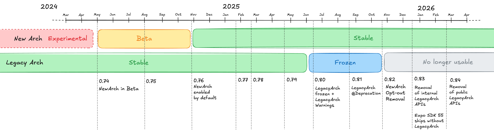

# RFC0929: Removal of the Legacy Architecture of React Native

## Summary

This RFC highlights the necessary steps to remove the Legacy Architecture from the core of React Native. This change aims to **reduce the app size**, **simplify the codebase**, and **unblock future developments** that are complicated while both architectures co-exist.

## Motivation

The React team has been maintaining two distinct React Native architectures (Legacy and New) for a significant period of time at this stage. 

Maintaining them comes with significant complexity, and creates unnecessary overhead for Meta engineers, core contributors, library maintainers and users of React Native.

By removing the Legacy Architecture, we aim to achieve the following goals:

* **Reduction in Application Size**: Currently all the React Native apps ship both Legacy and New Architecture. One of the two infrastructure is not used at runtime though, resulting in wasted APK/IPA space that we could save across the board. Reduction in application size comes with increase in user engagement which will benefit the React Native ecosystem overall.

> [!NOTE]  
> From [Optimizing mobile app performance to enhance user satisfaction and engagement](https://journalwjaets.com/sites/default/files/fulltext_pdf/WJAETS-2025-0303.pdf) - World Journal of Advanced Engineering Technology and Sciences · January 2025: Each 10MB increases uninstall probability by 3.7%. Plenty of other researches highlight the importance of reducing application size to drive engagement.

* **Improve Performance and Consistency:** The New Architecture offers superior capabilities (such as synchronous rendering, lazy loading of modules, type safety, etc.). Consolidating to a single architecture ensures all React Native applications can benefit from these advancements consistently.

* **Reduced User Overhead**: Currently React Native developers have to think whether a specific library supports the New Architecture before adopting it. This adds cognitive overhead and makes it difficult to tell if a library will work in a given project. In the longer run, moving to a single architecture simplifies this model as users don’t have to think about which architecture is supported for each library anymore, or if it’s supported via Interop layer or not.

* **Reduced Maintenance Overhead**: Up until this point, many features and components require separate implementations and testing for both the legacy and new architectures. This doubles the effort for development, debugging, and maintenance. Moreover, during React Native releases we had to duplicate the amount of testing due to the dual architecture which increased the release workload for the React Native release crew.

While we [already implemented](https://github.com/reactwg/react-native-new-architecture/discussions/290) part of this RFC earlier this year, we want to share it with the community and partners early on to give a heads up on what’s coming next for React Native in the coming releases.

## Timeline

The following is a rough timeline of the changes related to this RFC:



### Already implemented steps

* **2024-05-16:** New Architecture [is considered beta](https://github.com/reactwg/react-native-new-architecture/discussions/189)
* **2024-10-23: [React Native 0.76]** New Architecture is considered **[stable and generally available](https://reactnative.dev/blog/2024/10/23/the-new-architecture-is-here)**
* **2025-06-02:** Legacy Architecture [is considered frozen](https://github.com/reactwg/react-native-new-architecture/discussions/290). Specifically from that day:
    * We stopped working on Legacy Architecture.
    * We stopped accepting PRs that modify the Legacy Architecture.
    * We stopped testing the Legacy Architecture when releasing React Native.
* **2025-06-12: [React Native 0.80]** New Architecture [warnings are added](https://reactnative.dev/blog/2025/06/12/react-native-0.80#legacy-architecture-freezing--warnings)
    * Users will see a warning on DevTools when using Legacy Architecture.
    * Moreover, specific warnings have been added to notify the user if they’re using a pattern that won’t be supported by interop layers
* **2025-08-12: [React Native 0.81]** Further New Architecture classes are marked as `@Deprecated`
    * Users will be notified at build time if using a `@Deprecated` class through a build warning.

### Upcoming steps

* **2025-10-x: [React Native 0.82]** New Architecture opt-out is removed.
    * Users won’t be able to opt out of the newArchitecture anymore.
    * Specifically:
        * On Android, setting `newArchEnabled=false` will result in a warning message and the property will be hardcoded to `true`
        * To keep compatibility with libraries, we will set `newArchEnabled=true` if a user removes the `newArchEnabled` line from their `gradle.properties`.
        * On iOS
            * Installing pods with ``RCT_NEW_ARCH_ENABLED=0`` will result in a warning message and the property will be hardcoded to `1`
            * Changing the `RCTNewArchEnabled` flag in the `Info.plist` will be ignored
            * Overriding methods such as `newArchEnabled` in the AppDelegate will be ignored
        * To keep compatibility with libraries, we will set `RCT_NEW_ARCH_ENABLED=1`in all the podspecs, including the one autolinked. This will give library authors the time to remove the legacy arch code from their library.
    * We don’t forecast removal of Legacy Architecture APIs in this version (i.e. Legacy Architecture will still be inside React Native core, but not accessible).
* **2025-12-x: [React Native 0.83]** Legacy Architecture internal and non-public classes are removed
    * By this stage, we will start removing parts of the Legacy Architecture from the core of React Native (see list below).
    * In order to simplify the adoption, we won’t be removing the Interop Layer at all (see paragraph below - ‘The future of the Interop Layer’)
    * Also, in order to simplify the migration, we won’t be removing any public classes from Legacy Architecture at this point. This is to support libraries and modules that might still reference Legacy 
* **2025-12-x: Expo SDK 55**
    * We expect Expo SDK 55 to ship with this version of React Native. This is going to be the first version of Expo where users can’t opt out from the New Architecture.
* **2026-02-x: [React Native 0.84]** Legacy Architecture public classes will start to be removed
    * From 0.84, we will start removing classes and APIs from the Legacy Architecture. See below for the list of APIs we intend to remove.


## The future of the Interop Layer

In 2023 and 2024 we introduced several Interop Layers to make it easier to use non migrated libraries in New Architecture projects ([see here](https://github.com/reactwg/react-native-new-architecture/discussions/175)).

While previously we required all the modules and components to be migrated, the interop layers relaxed this requirement, allowing for broader adoption.

We want to clarify that we plan to **keep** the Interop Layers APIs around for the foreseeable future.

Therefore, we’ll keep the Legacy Architecture APIs used by the Interop Layer to make them work properly.

## APIs Planned for Removal

The following is a non-exhaustive list of the affected APIs which we plan to remove as part of this RFC.

> [!IMPORTANT]
> Please note that this list is constantly evolving as we’re collecting feedback from partners and library authors on how our APIs are used.

We’ll remove first the internal-only APIs, and move to the public facing APIs afterwards.

This is to reduce the amount of breaking changes while users migrate to versions of React Native beyond 0.82+, where New Arch is the only architecture.

### Android

On Android we use the `@LegacyArchitecture` annotation to mark classes that are due for removal.

We also `@Deprecated` several of those classes, so you will get build warnings in Gradle if you’re using them.


#### Android Internal APIs

The following classes are marked as Kotlin `internal` and planned for removal.

As those classes are `internal` you should not be accessing them directly and it should be safe to either remove them or stub them.

- [ ] `com.facebook.react.bridge.BridgeSoLoader`
- [ ] `com.facebook.react.bridge.CallbackImpl`
- [ ] `com.facebook.react.bridge.NativeArgumentsParseException`
- [ ] `com.facebook.react.bridge.ReactCxxErrorHandler`
- [ ] `com.facebook.react.bridge.ReactInstanceManagerInspectorTarget`
- [ ] `com.facebook.react.CoreModulesPackage`
- [ ] `com.facebook.react.ReactPackageLogger`
- [ ] `com.facebook.react.runtime.BridgelessCatalystInstance`
- [ ] `com.facebook.react.uimanager.debug.NotThreadSafeViewHierarchyUpdateDebugListener`
- [ ] `com.facebook.react.uimanager.layoutanimation.AbstractLayoutAnimation`
- [ ] `com.facebook.react.uimanager.layoutanimation.AnimatedPropertyType`
- [ ] `com.facebook.react.uimanager.layoutanimation.BaseLayoutAnimation`
- [ ] `com.facebook.react.uimanager.layoutanimation.InterpolatorType`
- [ ] `com.facebook.react.uimanager.layoutanimation.LayoutAnimationType`
- [ ] `com.facebook.react.uimanager.layoutanimation.LayoutCreateAnimation`
- [ ] `com.facebook.react.uimanager.layoutanimation.LayoutDeleteAnimation`
- [ ] `com.facebook.react.uimanager.layoutanimation.LayoutHandlingAnimation`
- [ ] `com.facebook.react.uimanager.layoutanimation.LayoutUpdateAnimation`
- [ ] `com.facebook.react.uimanager.layoutanimation.OpacityAnimation`
- [ ] `com.facebook.react.uimanager.layoutanimation.PositionAndSizeAnimation`
- [ ] `com.facebook.react.uimanager.layoutanimation.SimpleSpringInterpolator`
- [ ] `com.facebook.react.uimanager.LayoutDirectionUtil`
- [ ] `com.facebook.react.uimanager.NativeKind`
- [ ] `com.facebook.react.uimanager.NoSuchNativeViewException`
- [ ] `com.facebook.react.uimanager.ReactYogaConfigProvider`
- [ ] `com.facebook.react.uimanager.ShadowNodeRegistry`
- [ ] `com.facebook.react.uimanager.ViewAtIndex`
- [ ] `com.facebook.react.uimanager.YogaNodePool`
- [ ] `com.facebook.react.views.progressbar.ProgressBarShadowNode`
- [ ] `com.facebook.react.views.safeareaview.ReactSafeAreaViewShadowNode`
- [ ] `com.facebook.react.views.switchview.ReactSwitchShadowNode`
- [ ] `com.facebook.react.views.text.frescosupport.FrescoBasedReactTextInlineImageShadowNode`
- [ ] `com.facebook.react.views.text.ReactRawTextManager`
- [ ] `com.facebook.react.views.text.ReactRawTextShadowNode`
- [ ] `com.facebook.react.views.text.ReactVirtualTextShadowNode`
- [ ] `com.facebook.react.views.text.ReactVirtualTextViewManager`
- [ ] `com.facebook.react.views.textinput.ReactTextInputShadowNode`


#### Android Public APIs

The following classes are public and used in some open source projects. We’ll evaluate each of them and understand the feasibility of its removal.

- [ ] `com.facebook.react.bridge.BridgeReactContext`
- [ ] `com.facebook.react.bridge.CatalystInstanceImpl`
- [ ] `com.facebook.react.bridge.OnBatchCompleteListener`
- [ ] `com.facebook.react.bridge.ReactModuleWithSpec`
- [ ] `com.facebook.react.bridge.ReactNoCrashBridgeNotAllowedSoftException`
- [ ] `com.facebook.react.bridge.UIManagerProvider`
- [ ] `com.facebook.react.LazyReactPackage`
- [ ] `com.facebook.react.NativeModuleRegistryBuilder`
- [ ] `com.facebook.react.ReactInstanceManagerBuilder`
- [ ] `com.facebook.react.uimanager.layoutanimation.LayoutAnimationController`
- [ ] `com.facebook.react.uimanager.layoutanimation.LayoutAnimationListener`
- [ ] `com.facebook.react.uimanager.NativeViewHierarchyManager`
- [ ] `com.facebook.react.uimanager.NativeViewHierarchyOptimizer`
- [ ] `com.facebook.react.uimanager.OnLayoutEvent`
- [ ] `com.facebook.react.uimanager.ReactShadowNodeImpl`
- [ ] `com.facebook.react.uimanager.UIImplementation`
- [ ] `com.facebook.react.uimanager.UIManagerModuleListener`
- [ ] `com.facebook.react.uimanager.UIViewOperationQueue`
- [ ] `com.facebook.react.views.text.ReactBaseTextShadowNode`
- [ ] `com.facebook.react.views.text.ReactTextShadowNode`


### iOS

The following symbols are due for removal:

- [ ] `_RCTProfileBeginEvent`
- [ ] `_RCTProfileBeginFlowEvent`
- [ ] `_RCTProfileEndEvent`
- [ ] `_RCTProfileEndFlowEvent`
- [ ] `facebook::react::createNativeModules`
- [ ] `facebook::react::DispatchMessageQueueThread`
- [ ] `facebook::react::RCTJSIExecutorRuntimeInstaller`
- [ ] `facebook::react::RCTNativeModule`
- [ ] `RCTActivityIndicatorView`
- [ ] `RCTActivityIndicatorViewManager`
- [ ] `RCTBaseTextInputShadowView`
- [ ] `RCTBaseTextInputView`
- [ ] `RCTBaseTextInputViewManager`
- [ ] `RCTBaseTextShadowView`
- [ ] `RCTBaseTextShadowViewEmbeddedShadowViewAttributeName`
- [ ] `RCTBaseTextViewManager`
- [ ] `RCTBridgeDelegate`
- [ ] `RCTBridgeModuleListProvider`
- [ ] `RCTConvert (UIActivityIndicatorView)`
- [ ] `RCTConvert (UIScrollView)`
- [ ] `RCTDebuggingOverlayManager`
- [ ] `RCTImageShadowView`
- [ ] `RCTImageView`
- [ ] `RCTImageViewManager`
- [ ] `RCTInputAccessoryShadowView`
- [ ] `RCTInputAccessoryView`
- [ ] `RCTInputAccessoryViewContent`
- [ ] `RCTInputAccessoryViewManager`
- [ ] `RCTJavaScriptCallback`
- [ ] `RCTJavaScriptCompleteBlock`
- [ ] `RCTJavaScriptExecutor`
- [ ] `RCTModalHostView`
- [ ] `RCTModalHostViewController`
- [ ] `RCTModalHostViewInteractor`
- [ ] `RCTModalHostViewManager`
- [ ] `RCTModalManager`
- [ ] `RCTModalViewInteractionBlock`
- [ ] `RCTMultilineTextInputView`
- [ ] `RCTMultilineTextInputViewManager`
- [ ] `RCTObjcExecutorFactory`
- [ ] `RCTProfileBeginAsyncEvent`
- [ ] `RCTProfileCallbacks`
- [ ] `RCTProfileDidEndProfiling`
- [ ] `RCTProfileDidStartProfiling`
- [ ] `RCTProfileEnd`
- [ ] `RCTProfileEndAsyncEvent`
- [ ] `RCTProfileGetQueue`
- [ ] `RCTProfileHideControls`
- [ ] `RCTProfileHookInstance`
- [ ] `RCTProfileHookModules`
- [ ] `RCTProfileImmediateEvent`
- [ ] `RCTProfileInit`
- [ ] `RCTProfileIsProfiling`
- [ ] `RCTProfileRegisterCallbacks`
- [ ] `RCTProfileSendResult`
- [ ] `RCTProfileShowControls`
- [ ] `RCTProfileTagAlways`
- [ ] `RCTProfileUnhookModules`
- [ ] `RCTRawTextShadowView`
- [ ] `RCTRawTextViewManager`
- [ ] `RCTRefreshControl`
- [ ] `RCTRefreshControlManager`
- [ ] `RCTRootContentView`
- [ ] `RCTRootView`
- [ ] `RCTRootView ()`
- [ ] `RCTSafeAreaShadowView`
- [ ] `RCTSafeAreaView`
- [ ] `RCTSafeAreaViewLocalData`
- [ ] `RCTSafeAreaViewManager`
- [ ] `RCTScrollContentShadowView`
- [ ] `RCTScrollContentView`
- [ ] `RCTScrollContentViewManager`
- [ ] `RCTScrollView`
- [ ] `RCTScrollView (Internal)`
- [ ] `RCTScrollViewManager`
- [ ] `RCTSendFakeScrollEvent`
- [ ] `RCTSinglelineTextInputView`
- [ ] `RCTSinglelineTextInputViewManager`
- [ ] `RCTSurface`
- [ ] `RCTSurfaceRootShadowView`
- [ ] `RCTSwitch`
- [ ] `RCTSwitchManager`
- [ ] `RCTTextAttributes`
- [ ] `RCTTextAttributesIsHighlightedAttributeName`
- [ ] `RCTTextAttributesTagAttributeName`
- [ ] `RCTTextShadowView`
- [ ] `RCTTextView`
- [ ] `RCTTextViewManager`
- [ ] `RCTVirtualTextShadowView`
- [ ] `RCTVirtualTextView`
- [ ] `RCTVirtualTextViewManager`
- [ ] `RCTWrapperExampleView`
- [ ] `RCTWrapperExampleViewController`
- [ ] `RCTWrapperMeasureBlock`
- [ ] `RCTWrapperReactRootViewController`
- [ ] `RCTWrapperReactRootViewManager`
- [ ] `RCTWrapperShadowView`
- [ ] `RCTWrapperView`
- [ ] `RCTWrapperView`
- [ ] `RCTWrapperViewControllerHostingView`
- [ ] `RCTWrapperViewManager`
- [ ] `systrace_arg_t`
- [ ] `UIScrollViewDelegate`
- [ ] `UIView (RCTScrollView)`


### C++

In C++ we use the `RCT_FIT_RM_OLD_RUNTIME` macro to annotate classes that are due for removal.

If a class or a symbol is wrapped inside a:

```c++
#ifndef RCT_FIT_RM_OLD_RUNTIME
...
#endif
```

We identified that that specific symbol is part of the legacy architecture and should be removed.

The list of C++ symbols we intend to remove is the following:

- [ ] `facebook::react::buildNativeModuleList`
- [ ] `facebook::react::CatalystInstanceImpl`
- [ ] `facebook::react::CxxNativeModule`
- [ ] `facebook::react::Instance`
- [ ] `facebook::react::JavaModuleWrapper`
- [ ] `facebook::react::JavaNativeModule`
- [ ] `facebook::react::JavaScriptExecutorHolder`
- [ ] `facebook::react::JInstanceCallback`
- [ ] `facebook::react::JMethodDescriptor`
- [ ] `facebook::react::JniJSModulesUnbundle`
- [ ] `facebook::react::JSExecutor`
- [ ] `facebook::react::JSIExecutor`
- [ ] `facebook::react::JSINativeModules`
- [ ] `facebook::react::JSIndexedRAMBundle`
- [ ] `facebook::react::JSModulesUnbundle`
- [ ] `facebook::react::MethodCall`
- [ ] `facebook::react::ModuleConfig`
- [ ] `facebook::react::ModuleHolder`
- [ ] `facebook::react::ModuleRegistry`
- [ ] `facebook::react::NativeModule`
- [ ] `facebook::react::NativeToJsBridge`
- [ ] `facebook::react::parseMethodCalls`
- [ ] `facebook::react::RAMBundleRegistry`

### JS

The following JavaScript definitions are related to the Legacy Architecture. They are all **private** and should not be accessed as of today.

We don’t consider those part of the public API, and you should not be accessing them (see also [Deprecating deep imports from react-native](https://reactnative.dev/blog/2025/06/12/moving-towards-a-stable-javascript-api#deprecating-deep-imports-from-react-native)).

We’re looking into removing them from the React Native bundle in the near future:

- [ ] `Libraries/BatchedBridge/BatchedBridge.js`
- [ ] `Libraries/BatchedBridge/MessageQueue.js`
- [ ] `Libraries/Core/Timers/immediateShim.js`
- [ ] `Libraries/Core/Timers/JSTimers.js`
- [ ] `Libraries/Core/Timers/NativeTiming.js`
- [ ] `Libraries/Renderer/shims/createReactNativeComponentClass.js`
- [ ] `src/private/specs_DEPRECATED/modules/NativeTiming.js`

We will also be removing the copies of the React rendered used for Legacy Architecture:

- [ ] `Libraries/Renderer/implementations/ReactNativeRenderer-dev.js`
- [ ] `Libraries/Renderer/implementations/ReactNativeRenderer-prod.js`
- [ ] `Libraries/Renderer/implementations/ReactNativeRenderer-profiling.js`
